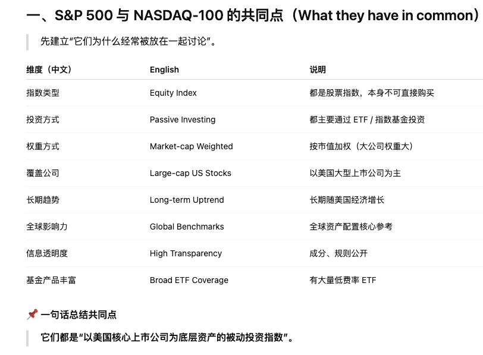
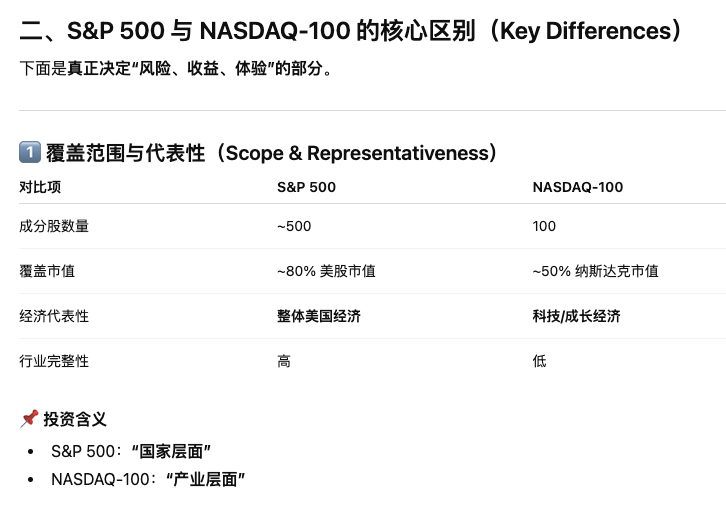

# 市场结构

## Primary Market 一级市场

- IPO, 定增, 可转债发行
- 公司卖股票拿钱

## Secondary Market 二级市场

- 交易市场: 沪深交易所, 北交所
- 投资者相互买卖股票

## IPO (Initial Public Offering) 公司首次公开募股

## Refinancing 再融资

## Listed Company 上市公司

## Delisting 退市

# 资产类别

## Money Market Fund 货币基金

## Bond 债券

## Stock/Equity 股票

## Equity Fund 股票基金

## Index Fund 指数基金

## ETF (Exchange Trade Fund) 场内交易的指数基金

## Balanced Fund 混合基金

股债混合

## REITs (Real Estate Investment Trusts) 不动产收益证券化

# 宏观指标

## GDP (Gross Domestic Product) 

经济总量和增长

## CPI (Consume Price Index)

通胀水平, 影响利率

## PPI (Product Price Index)

企业成本压力

## Interest Rate 利率

## Monetary Policy 货币政策

## Fiscal Policy 财政政策

政府支出和税收

## Total Social Financing 社融

## M2 (Broad Money Supply) 

流动性判断

# 股票投资核心财务指标

## Market Capitalization 市值

## P/E ratio 市盈率

估值核心指标

## P/B ratio 市净率

公司安全边际

## Net Profit 净利润

## Gross Margin 毛利率

## ROE 净资产收益率

## Cash Flow 现金流

## Dividend Yield 分红率

# 基金指标

## Fund Manager 基金经理

## Fund Size 基金规模

## Historical Performance 历史业绩

## Maximum Drawdown 最大回撤

## Sharp Ratio 夏普比率

## Tracking Error 跟踪误差

## Management Fee 管理费

# 关于基金的更多信息

- Public Mutual Fund 公募基金: 面向公众发行, 信息披露要求高
- Private Mutual Fund 私募基金: 面向合格投资者, 风险和门槛更高

## 按类型划分

- Money Market Fund: 货币基金
- Bond Fund: 债券基金
- Equity Fund: 股票基金
- Balanced / Hybrid Fund: 混合基金
- Commodity Fund: 商品基金 (黄金, 原油等)
- REITs: 不动产收益

货币 --> 债 --> 混合 --> 股

## 按运作方式分类

- Open-ended Fund: 开放式基金, 可随时申购/赎回
- Closed-ended Fund: 封闭式基金, 
- ETF (Exchange Trade Fund): 像股票一样交易的基金

## 按投资方式

- Active Fund: 主动基金
- Passive Fund: 被动基金
- Index Fund: 指数基金
- Smart Beta Fund: 

## 按投资区域

- Domestic Fund: 国内基金
- QDII: Qualified Domestic Institutional Investor, 投资海外
- Global Fund: 全球基金

## 按收益分配方式

- Accumulating Fund: 收益再投资
- Distributing Fund: 定期分红

## 基金的一个简单的类比

- Active Fund: 请名厨点菜
- Passive Fund: 自助餐
- Index Fund: 菜单
- 增强型基金: 自助餐 + 少量加菜

# sp500 vs. nasdaq100

## 共同点

## 区别

